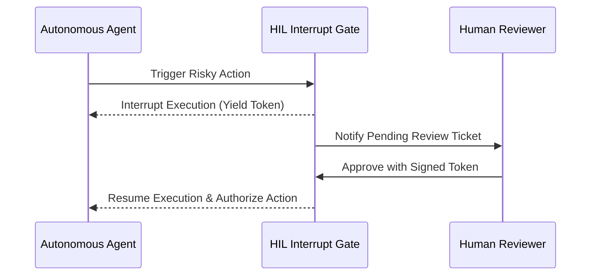

# genpark-human-in-the-loop-approval-gate-interrupt-skill

Human-in-the-loop (HIL) approval gate and execution interrupt controller with cryptographic review tokens and diff inspection.

Developed and maintained by **GenPark AI** (https://genpark.ai). Browse high-star agent capabilities on the **GenPark Model Context Protocol Directory** (https://genpark.ai/mcp).

## Features
- **Cryptographic Review Tokens**: Token-bound approval validation prevents replay attacks.
- **Role-Based Authorization**: Configurable required role for approval release.
- **Zero External Dependencies**: Pure Python standard library.
